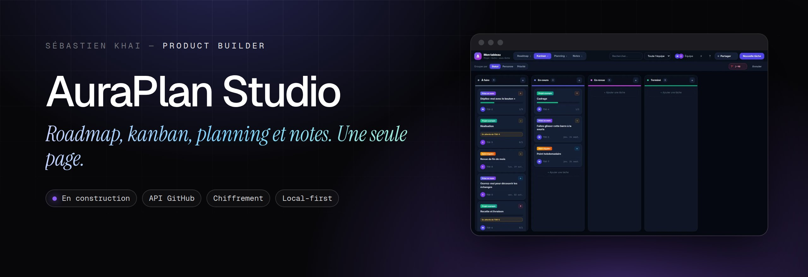
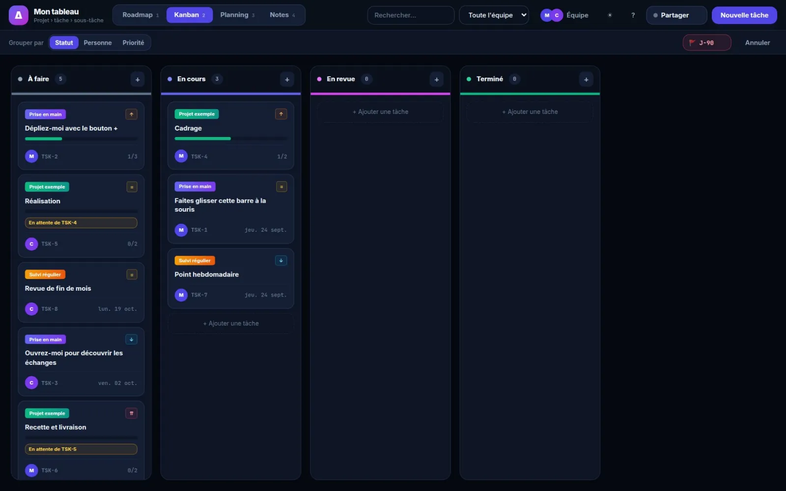
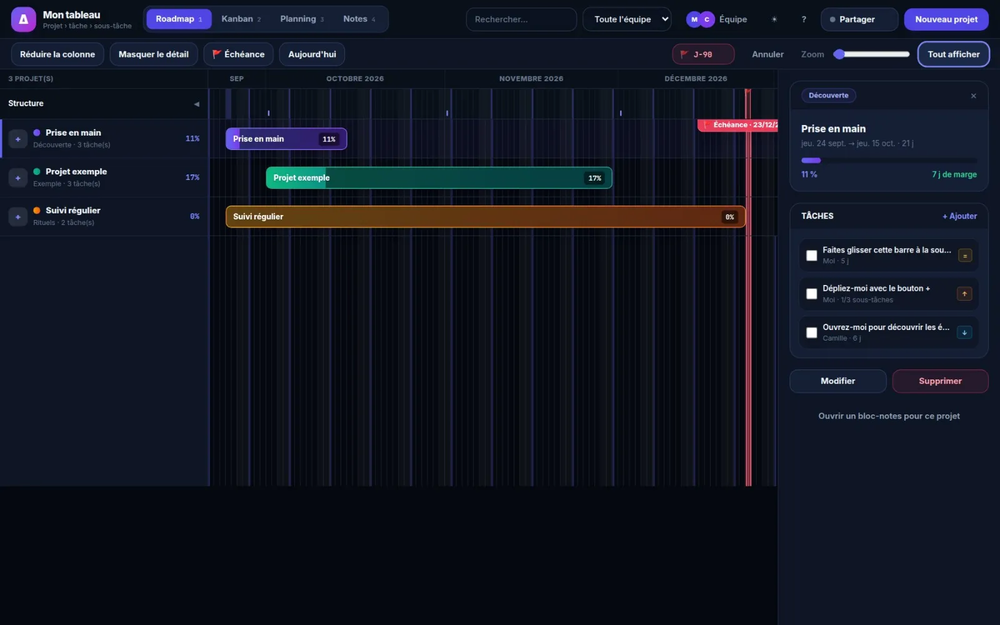

  
  
  

<h1 align="center">AuraPlan Studio</h1>

<b>Roadmap, kanban, planning et notes. Une seule page.</b> Un studio de planification léger pour piloter des projets en solo ou en équipe, sans abonnement et sans confier ses données à un tiers.

---

### Le problème

Les outils type Jira sont puissants mais lourds pour de petits projets, et hébergent vos données chez eux.

### L'idée

Les vues essentielles d'un outil de gestion de projet, dans une seule page qui se synchronise avec un dépôt GitHub personnel.

### Comment c'est fait

Application en un seul fichier. Chaque sauvegarde devient un commit ; les données sont compressées et chiffrées directement dans le navigateur.

**Outils** &nbsp; `API GitHub` `Chiffrement` `Local-first`

### Aperçu

 

### Mentions

Jira est une marque d'Atlassian ; AuraPlan n'est ni affilié ni lié à Atlassian.

### English

**AuraPlan Studio** — *Roadmap, kanban, planning and notes. One single page.* A lightweight planning studio to run projects solo or as a team, with no subscription and no handing your data to a third party.

Jira-style tools are powerful but heavy for small projects, and they host your data. The essential views of a project management tool, in a single page that syncs with a personal GitHub repository. A single-file app. Each save becomes a commit; data is compressed and encrypted right in the browser.

---

Conçu, développé et mis en ligne par <b>Sébastien Khai</b>, Product Builder · <a href="https://engob.github.io/portofolio/">portfolio</a> · <a href="https://engob.github.io/portofolio/projets/auraplan/">fiche du projet</a> © 2026 Sébastien Khai — tous droits réservés.

